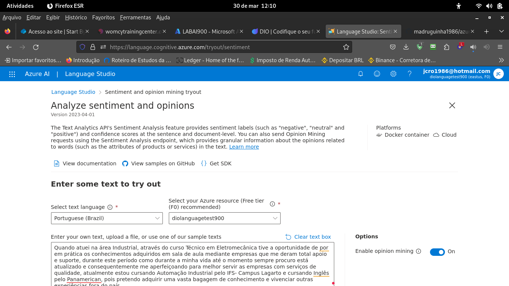
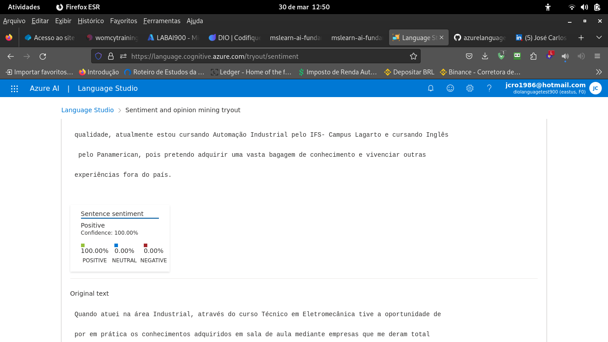
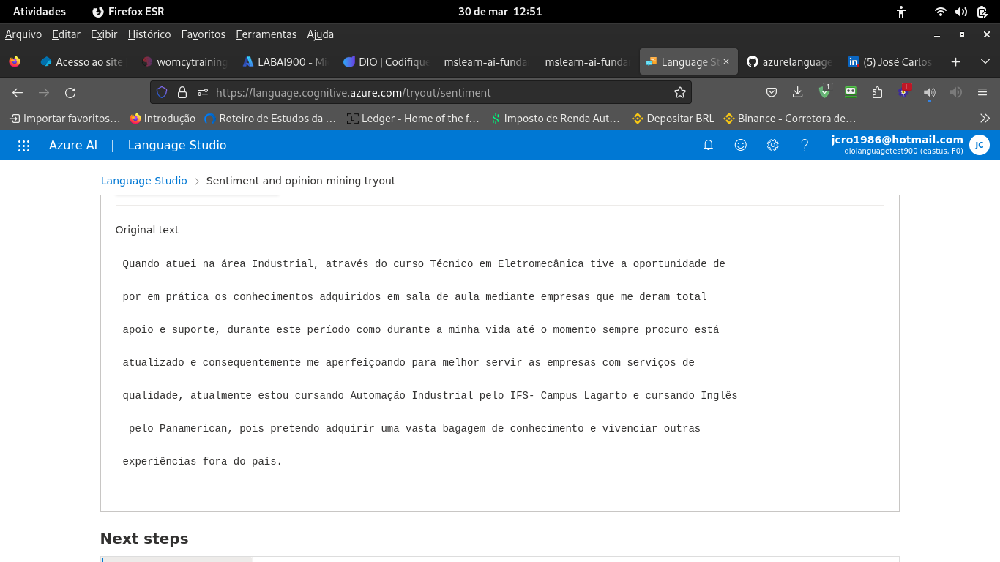

# Primeira parte do laboratório: Utilizando o Language Studio.

## Criando o recuso no portal Azure.

Fora utilizado o seguinte [link](https://microsoftlearning.github.io/mslearn-ai-fundamentals/Instructions/Labs/06-text-analysis.html), esse link é o passo a passo do laboratório.

Após essa etapa, acessei o portal: [https://language.cognitive.azure.com/](https://language.cognitive.azure.com/)

Utilizei um texto de minha autoria do meu [LinkedIn](www.linkedin.com/in/josé-carlos-rodriguess-oliveira-66840031) e obtive os resultados: 

## Imagens com entradada de dados

Imagem contendo os dados de entradas.

## Primeira Imagem

O resultado que a IA apresentou foi para esse caso positivo, ninguém em sâ consciência irá escrever um texto depressivo para ser contratado. kkkkkkk

## Segunda Imagem

Resultado complementar.

Impressões: É incrível a gama de possibilidades que a Microsoft apresenta cono essa IA, realmente ela é uma mão nos bytes. 

